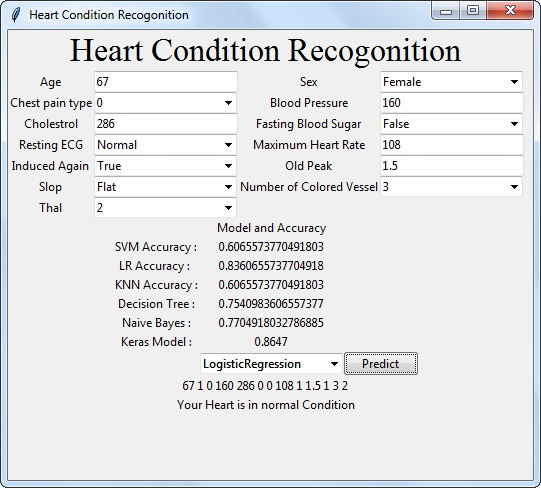
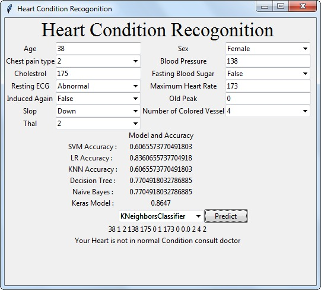
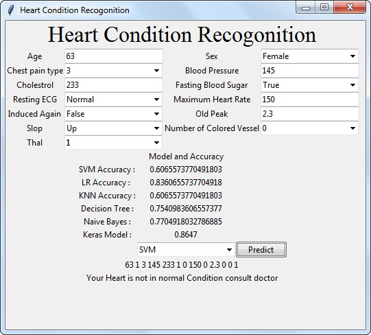
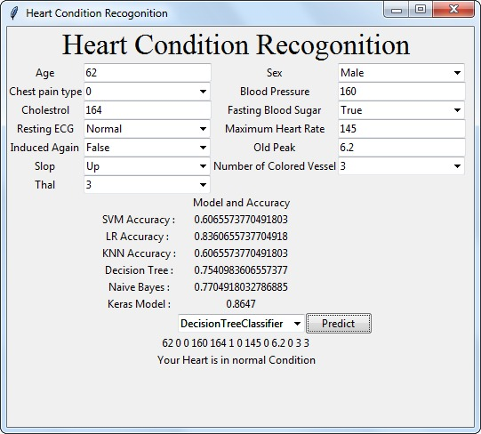

<div id="top"></div>

<!-- PROJECT LOGO -->
<br />
<div align="center">
  <a href="https://github.com/Parthp1810/Heart-Condition-Recognition-ML">
    
  </a>

<h3 align="center">Heart Condition Recognition</h3>

  <p align="center">
    An assitive technology which harnesses the power of machine learning to accurately predict the existence of a heart disease in a patient and thereby letting doctors anticipate any forecoming ailments by also maintaining a record of all previous predictions. Provides a means of communication between the Doctor and his Patients for any time consultancy. Notifies the doctor anytime the patient submits a report with a critical value for any parameter.
  </p>
</div>


<!-- TABLE OF CONTENTS -->
<details>
  <summary>Table of Contents</summary>
  <ol>
    <li>
      <a href="#about-the-project">About The Project</a>
      <ul>
        <li><a href="#built-with">Built With</a></li>
      </ul>
    </li>
    <li>
      <a href="#getting-started">Getting Started</a>
      <ul>
        <li><a href="#prerequisites">Prerequisites</a></li>
        <li><a href="#installation">Installation</a></li>
      </ul>
    </li>
    <li><a href="#usage">Usage</a></li>
    <li><a href="#contact">Contact</a></li>
  </ol>
</details>


<!-- ABOUT THE PROJECT -->
## About The Project

A major challenge facing healthcare organizations is the provision of quality services at affordable costs. Hospitals must also minimize the cost of clinical tests. They can achieve these results by employing appropriate computer-based information and decision support systems.
	
Here's why:
* A major challenge, facing healthcare organizations (hospitals, medical centers) is the provision of quality services at affordable costs. Quality service implies diagnosing patients correctly and administering treatments that are effective. Integration of clinical decision support with computer-based patient records could reduce medical errors, enhance patient safety, decrease unwanted practice variation, and improve patient outcome. In spite of the rapid development of pathological research and clinical technologies, people die suddenly due to many diseases.
* A number of techniques have been used for diagnosing heart disease including artificial neural network and various other modeling algorithms. But it has been observed that 13 classification accuracies were not good with these techniques and still enough scope in improving by choosing appropriate ML model.

**Logistic Regression** <br />
<p align="center">
     
</p>

**K-Nearest Neighbors** <br />
<p align="center">
     
</p>

**Support Vector Machine (SVM)** <br />
<p align="center">
     
</p>

**Decision Tree Classifier** <br />
<p align="center">
     
</p>

<p align="right">(<a href="#top">back to top</a>)</p>


### Built With

* [Jupyter Notebook](https://jupyter.org/)
* [Tensorflow](https://www.tensorflow.org/)
* [SciKit](https://scikit-learn.org/)
* [Numpy](https://numpy.org/)
* [Pandas](https://pandas.pydata.org/)
* [Python](https://www.python.org/)

<p align="right">(<a href="#top">back to top</a>)</p>


<!-- GETTING STARTED -->
## Getting Started

### Prerequisites

Install required Libraries to execute the program are:
* [Jupyter Notebook](https://jupyter.org/)
* [Tensorflow](https://www.tensorflow.org/)
* [SciKit](https://scikit-learn.org/)
* [Numpy](https://numpy.org/)
* [Pandas](https://pandas.pydata.org/)

### Installation

1. Clone the repo
   ```sh
   git clone https://github.com/Patel-Parthkumar/Heart-Condition-Recognition-ML.git
   ```
2. Change directory to the folder
   ```sh
   cd Heart-Condition-Recognition-ML
   ```
3. Run the program
   ```sh
   python Label1.py
   ```

<p align="right">(<a href="#top">back to top</a>)</p>


<!-- USAGE EXAMPLES -->
## Usage

Data Dictionary for Result Analysis.

| Input | Description | Value |
| --------------- | --------------- | --------------- |
| Age | Age of a person matters the most when checking condition of heart | Numeric (>14) |
| Sex | Male or Female (Female are 59% time miss-diagnosis of heart condition) | 1,0 |
| Chest Pain Type | Angina, abnormal, no tang, asymptomatic | 1,2,3,4 |
| Blood Pressure | High and low blood pressure are major cause for heart failure | Numeric |
| Cholesterol | Cholesterol show the blockage in arteries of heart | Numeric |
| Fasting Blood Sugar | It is used as a test for diabetes | Value 0 = <120mg/dl <br /> Value 1 = >120mg/dl |
| Resting ECG | ECG is a test that measures the electrical activity of the heart | Value 0 = Normal <br /> Value 1 = Abnormal <br /> Value 2 = hype |
| Maximum Heart Rate | Heart rate is the speed of the heartbeat measured by the number of contractions of the heart per minute | Numeric |
| Induced Angina | Angina is a pain or discomfort felt in your Chest, which is usually caused by coronary heart disease | Value 0 = False <br /> Value 1 = True |
| Old Peak | Value of peak exercise oxygen consumption | Numeric |
| Slop | The slope is the predictor for presence and severity of coronary artery heart Disease | Value 1 = UP <br /> Value 2 = Flat <br /> Value 3 = Down |
| Number of Coloured Vessel | Blood vessels transport blood around the body, also play a role in controlling blood pressure | 0,1,2,3 |
| Thal | Cold Spots on the scan, where no thallium shows up | Value 3 = Normal <br /> Value 6 = Fixed Defect <br /> Value 7 = Reversible Defect |
| Class | The project will classify the heart disease into four categories class 0, class 1, class 2, class 3 | Class 0 = Normal <br /> Class 1 = First Stage <br /> Class 2 = Crucial Stage<br /> Class 3 = End of Life |

<p align="right">(<a href="#top">back to top</a>)</p>


<!-- CONTACT -->
## Contact

Contributors Names and Contact Info

* Parthkumar Patel
* Rohan Patel
* Heni Tailor
* Yakin Patel

<p align="right">(<a href="#top">back to top</a>)</p>

